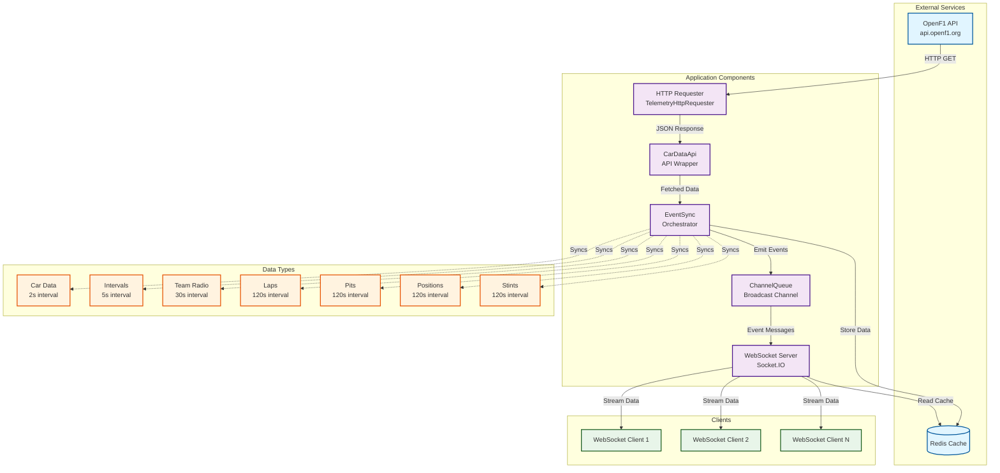

# formula-one-telemetry

Currently a work in progress using the [openf1.org](https://openf1.org/) to aggregate real time race data. When complete this is intended to be a highly concurrent data streaming application. The impetus for the project is to learn rust, and specifically understand it's concurrency model.

## api requests supported: (13/13)
- car data
- drivers 
- intervals
- laps
- location
- meetings
- pit
- position
- race controls
- sessions
- stints
- team radio
- weather


## Desired Feature List
- [X] redis request caching
- [ ] otel open telemetry tracing
- [X] http server
- [X] websocket messages for:
  - [X] car_data
  - [X] intervals
  - [X] team_radio
  - [X] laps
  - [X] pit
  - [X] position
  - [X] stints
  - [ ] session
- [X] websocket data pre-fetch
- [X] cache data for each driver for:
  - [X] car_data
  - [X] position  
  - [X] laps

Note: more endponts might be required to make metadata available for filtering
the above endpoints.

## [API data source](https://openf1.org/?shell#introduction)

## Architecture

### System Overview

This service aggregates real-time Formula One race data from the OpenF1 API, caches it in Redis, and streams it to clients via WebSocket connections.

### Architecture Diagram



### Component Details

#### HTTP Requester
- **Purpose**: Makes HTTP GET requests to external APIs
- **Implementation**: Uses `attohttpc` for synchronous HTTP requests
- **Returns**: Deserialized JSON responses

#### CarDataApi
- **Purpose**: Wrapper around HTTP Requester that provides typed methods for F1 data endpoints
- **Endpoints**: Car data, intervals, laps, pits, positions, stints, team radio, sessions, drivers, etc.
- **Base URL**: `https://api.openf1.org`

#### EventSync (Orchestrator)
- **Purpose**: Coordinates periodic data synchronization from the API
- **Functionality**:
  - Runs multiple sync tasks concurrently using `tokio::join!`
  - Each data type has its own sync interval:
    - **Car Data**: Every 2 seconds (per driver)
    - **Intervals**: Every 5 seconds
    - **Team Radio**: Every 30 seconds
    - **Laps, Pits, Positions, Stints**: Every 120 seconds
  - Fetches data via CarDataApi
  - Stores data in Redis using `redis_fire_and_forget`
  - Emits events to ChannelQueue after each sync

#### ChannelQueue
- **Purpose**: Event bus using Tokio broadcast channels
- **Functionality**:
  - Publishes `Event` messages when data is synced
  - Allows multiple subscribers (WebSocket server)
  - Decouples data sync from data distribution

#### Redis Cache
- **Purpose**: Stores cached F1 telemetry data
- **Key Patterns**:
  - `car_data:{driver_number}` - Per-driver car data
  - `intervals` - Interval data
  - `team_radio` - Team radio messages
  - `laps:{driver_number}` - Per-driver lap data
  - `pits` - Pit stop data
  - `position:{driver_number}` - Per-driver position data
  - `stints` - Stint data
- **Storage**: JSON-serialized data

#### WebSocket Server
- **Purpose**: Streams cached data to connected clients
- **Implementation**: Uses Socket.IO (via `socketioxide`)
- **Functionality**:
  - Listens to ChannelQueue for sync events
  - On event: fetches corresponding data from Redis and broadcasts to all clients
  - On client connect: performs cache prefetch to send all available data immediately
  - Server runs on `127.0.0.1:3000`

### Data Flow

1. **Initialization**:
   - Service starts and connects to Redis
   - EventSync begins periodic data fetching
   - WebSocket server starts listening

2. **Periodic Sync Loop**:
   ```
   EventSync → CarDataApi → HTTP Requester → OpenF1 API
                                      ↓
   EventSync ← JSON Response ← HTTP Requester
        ↓
   EventSync → Redis (store data)
        ↓
   EventSync → ChannelQueue (emit event)
   ```

3. **Client Connection**:
   ```
   Client → WebSocket Server (connect)
        ↓
   WebSocket → Redis (prefetch all data types)
        ↓
   WebSocket → Client (send initial data)
   ```

4. **Real-time Updates**:
   ```
   ChannelQueue → WebSocket (event received)
        ↓
   WebSocket → Redis (fetch updated data)
        ↓
   WebSocket → All Clients (broadcast update)
   ```

### Concurrency Model

- **EventSync**: Uses `tokio_scoped::scope` to spawn concurrent tasks for:
  - Multiple drivers (car data, laps, positions fetched in parallel)
  - Multiple data types (all sync tasks run concurrently via `tokio::join!`)
- **WebSocket**: Each client connection runs in its own async task
- **ChannelQueue**: Broadcast channel allows multiple subscribers

### Notes

- The service waits 5 seconds after EventSync starts before starting the WebSocket server to allow initial cache population
- Some data types are cached per-driver (car_data, laps, position) while others are global (intervals, pits, stints, team_radio)
- The laps sync is currently commented out in the code due to timing constraints (only works if app starts at session beginning)
